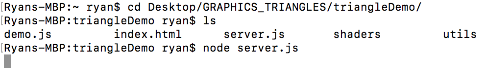
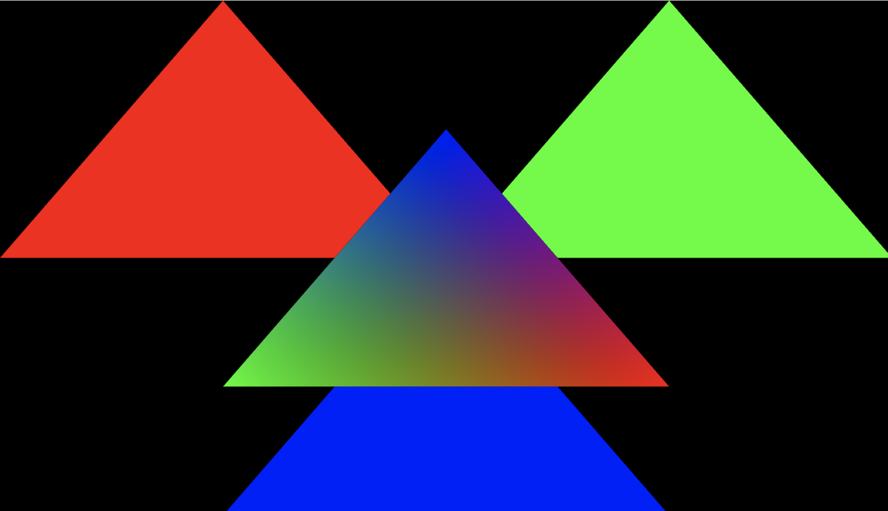
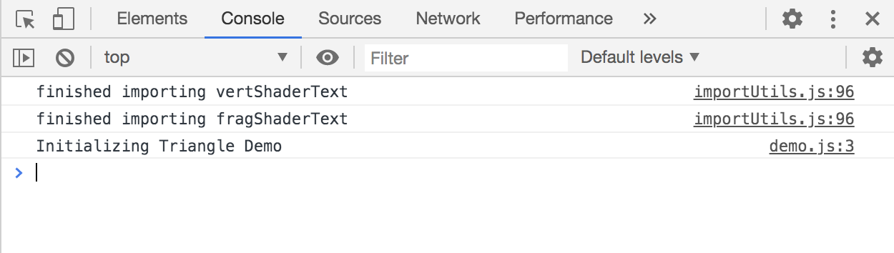

# Computer Graphics: Drawing Triangles with WebGL

In this lab, you will learn how to draw triangles on the HTML5 canvas in JavaScript using WebGL. Triangles will be drawn directly in Clip Space; there will be no transforms necessary.

Start by downloading the contents of this repository. You'll only need the contents of the `triangleDemo` folder (the other contents are for these instructions).

We will cover the following topics, in this order:

1. Setup and test your environment.
2. Explain the demonstration provided in `triangleDemo`.
3. Modify the demonstration to draw something.

Before we go through how all of these files interact and what they all do, let's set up your environment.

# Environment Setup

You should complete this section and ensure that you can see the same scene as the one displayed at the end of it before moving on. Don't hesitate to ask for help!

## Installing Node

In order to view our projects in the browser, we will be hosting them on `localhost:8080` using *Node.js*. 

Go to [https://nodejs.org/en/download/](https://nodejs.org/en/download/) and download and install the appropriate version of *Node.js*, which will be used to host your lab.

## Running

After *Node.js* is installed, you can host and view your lab using the following steps:

1. Navigate into the lab directory in your terminal. You should be in the same directory as `server.js`, which will be provided with each lab handout. In this lab, that means you'll be in the `triangleDemo` folder.
2. Run the command `node server.js`. This will host the lab on a local webserver at `localhost:8080`. The server should keep running until you stop it (with `command C` on Mac or `ctrl C` on Windows); it should look like this:
 
3. Open your browser and enter `localhost:8080` into the address bar. If everything has gone smoothly, you should see the following display:
 
 
 Once you are at this point, you do not need to go through this process again to update your lab; simply change files and then refresh the page, and your changes will be reflected. If you see a white screen, it means you've introduced errors with your changes, which you can view by right clicking and selecting "inspect", and then going to the "console" tab.

# Demonstration Walkthrough

Next, we will go through the files and discuss what they each do. Some of them will be glossed over, to be covered more sincerely in later labs. Some will be glossed over to never be really covered at all, as they are simply supporting utilities which are not relevant to this course and which will not need to be edited.

Note that you'll need to open and edit files in your labs; I simply use Sublime Text for this, but most students prefer to use an IDE of some sort. You may use whatever environment you desire.

## `server.js`

This file defines how the local server will behave. You can literally go all semester without ever opening this, and just let it be a black box.

## `utils/importUtils.js`

This file defines some utilities to help us read text and JSON files in JavaScript. You'll need to learn a little about how the import utilities behave to import your supporting files, and this will be explained briefly when we talk about `demo.js` here, but we won't be changing what is imported at all in this lab.

## `shaders/vert.glsl` and `shaders/frag.glsl`

These specify how to draw each vertex and fragment. We haven't yet discussed what vertices and fragments are yet; these will be covered in a later lab. For now, just know that each object that we draw will have an associated shader, consisting of a vertex shader and a fragment shader, and that these shaders declare variables which we will define values for in by passing in data from our JavaScript files.

## `index.html`

`index.html` has the following contents:

```html
<html>
	
	<body onload="InitDemo();">
		<canvas id="the_canvas">
			Get a current browser!
		</canvas>
	</body>
	
	<script src="utils/importUtils.js"></script>
	<script src="demo.js"></script>

</html>
```

It does the following things:

* Attempts to create a canvas, on which we will draw in JavaScript. Prints "Get a current browswer!" if it cannot create a canvas.
* Provides paths to all source files, in this case only `demo.js` and `utils/importUtils.js`.
* Specifies that `InitDemo()` (defined in `demo.js`) should be called when it finishes loading in all supporting files.

# `demo.js`

This is where we will spend all of our time today. The vast majority of this file is "setup", and only a small portion of it will be edited by you, but we will still walk through every part of it and briefly discuss what each part does.

## `InitDemo`

We'll start at the bottom, where the `InitDemo` function is defined; recall, this function is the entry point for our demonstration specified in `index.html`:

```javascript
var InitDemo = function()
{
	// files to import
	var imports = [
		// key             path
		["vertShaderText", "shaders/vert.glsl"],
		["fragShaderText", "shaders/frag.glsl"]
	];

	// The importer imports the requested files (as text or JSON)
	// and puts them in a dictionary called "filemap" in the RunDemo function above.
	// The dictionary is a hashmap
		// key --> file
		// so filemap["vertShadertext"] will return the text from the file at "shaders/vert.glsl"
	var importer = new resourceImporter(imports, RunDemo);
}
```

As the comments in the snippet above explain, this function imports the assets specified in the `imports` array. When it is done, it calls the `RunDemo` function, and passes in a dictionary of the imported assets so they can be accessed on demand. The call to `RunDemo` is not obvious here; it is done by the constructed `ResouceImporter`, as a callback, once it has finished importing all requested files. Feel free to check out `importUtils.js` to see the flow of events here, or just trust it.

This is how we get to `RunDemo`, which comprises the majority of `demo.js`. If any files cannot be imported, we will never make it to `RunDemo`, and an error will be printed in the console in the browser.

## `RunDemo`

This is the meat of the demonstration. It does a lot of setup, and then draws two triangles. We'll go through it piece by piece.

```javascript
var RunDemo = function(filemap)
```

We can see `RunDemo` takes an argument, called `filemap`. This `filemap` is a the dictionary constructed by the resource importer; it maps the key of every imported file to the string value of the contained file. In future labs, some of the files will be JSON objects instead of strings, but for now we're just importing shaders in string form.

## Log

```javascript
console.log("Initializing Triangle Demo");
```

This is the simplest way to print to the console in JavaScript. If you right click in your browser with the demo active and select "inspect", then select the browser tab, it should look something like this (with some variation in aesthetics between browswers):



Notice that before `"Initializing Triangle Demo"` is printed, there are two messages confirming that each imported text was successful. These prints are done by the resource importer created in `InitDemo`.

## Get and resize the canvas

```javascript
// get reference to the canvas (made in the HTML file)
var canvas = document.getElementById("the_canvas");

// resize canvas to fill window
canvas.width = window.innerWidth;
canvas.height = window.innerHeight;
```

As the comments specify, this snippet stores a reference to the canvas (created in `index.html` in the variable `canvas`, so we can reference it later when we draw on it. Notice that the ID provided to "get" the canvas is `"the_canvas"`, which is the ID the canvas was given when it was created in `index.html`.

Once the reference to the canvas has been stored, it is resized to match the window size, so the demo fills all available space in the browser.

## Get the WebGL Context

```javascript
// get reference to the WebGL context
var gl = canvas.getContext("webgl");

// check that WebGL context was succesfully referenced
// try to fix if not
if (!gl)
{
	console.log("WebGL context not found; checking for experimental WebGL");
	gl = canvas.getContext("experimental-webgl");
}

if (!gl)
{
	alert("No WebGL context found; this demo requires a browswer which supports WebGL");
	return; // no WebGL means we're done, nothing to do...
}
```

This snippet stores a reference to the WebGL context in a variable `gl`. If it fails to do so, it ends the demonstration.

Recall that WebGL is a rasterization API, which we will be using to draw on the canvas.

## Configure the WebGL Context

```javascript
// set WebGL's viewport (i.e. "where it can draw") to cover the canvas
gl.viewport(0, 0, canvas.width, canvas.height);

// set background color of canvas (to black)
		   // Red Green Blue Alpha
gl.clearColor(0.0, 0.0, 0.0, 1.0);

// apply the clear color set above
gl.clear(gl.COLOR_BUFFER_BIT | gl.DEPTH_BUFFER_BIT);

// enable the "depth test" to not render objects which are behind others
gl.enable(gl.DEPTH_TEST);

// set the front face of each triangle to the counterclockwise side
gl.frontFace(gl.CCW);

// tell WebGL that the back face is the face that should be culled (i.e. not shown)
gl.cullFace(gl.BACK);

// enable gl to cull faces so it can cull the back faces from above
gl.enable(gl.CULL_FACE);
```

This snippet does the following:

* Specifies the area in which the WebGL context referenced by `gl` is allowed to draw.
* Sets the background color to `(0.0, 0.0, 0.0, 1.0)`. The first three elements are the red, green and blue values of the background color, which is currently set to black. The fourth element specifies the alpha of the background color, which is currently set to `1.0`, meaning "completely opaque", where `0.0` would mean "completely transparent".
* Enables the "depth test", so items which are "behind" other items can be omitted from drawing. If you comment out `gl.clear(gl.COLOR_BUFFER_BIT | gl.DEPTH_BUFFER_BIT);`, the three outer triangles in the display will suddenly appear to be in front of the multi-colored one in the middle, even though we will draw them behind the middle one, because they are drawn after the middle one we don't skip drawing the parts that are behind the middle one.
* Specifies which side of each triangle is the "front".
	* A triangle is specified as three vertices (the cornders), and the order of these vertices matters. The triangle is only visible from one side: the side from which the three vertices, in the specified order, create a counter-clockwise cycle (hence `CCW`).
* Tells WebGL not to draw the backs of the triangles; triangles are all invisible from behind. There's no reason to draw faces that we can't see, so it would be wasted work to do so.

## Compile Shaders

```javascript
// get vertex and fragment shader text from the importer
var vertShaderText = filemap["vertShaderText"]; // see "InitDemo" at bottom for keys/names
var fragShaderText = filemap["fragShaderText"];

// create empty vertex and fragment shader objects
var vertShader = gl.createShader(gl.VERTEX_SHADER);
var fragShader = gl.createShader(gl.FRAGMENT_SHADER);

// populate the two empty shaders with the text from our imported glsl files
gl.shaderSource(vertShader, vertShaderText);
gl.shaderSource(fragShader, fragShaderText);

// compile the vertex shader and check that it compiled correctly
gl.compileShader(vertShader);
if (!gl.getShaderParameter(vertShader, gl.COMPILE_STATUS))
{
	// if it didn't compile correctly, log the reason in the console
	console.error("Cannot compile vertex shader.", gl.getShaderInforLog(vertexShader));
	return; // we can't continue without a working vertex shader
}

// compile the fragment shader and check that it compiled correctly
gl.compileShader(fragShader);
if (!gl.getShaderParameter(fragShader, gl.COMPILE_STATUS))
{
	console.error("Cannot compile fragment shader.", gl.getShaderInfoLoc(fragmentShader));
	return;
}
```

This snippet accesses the the imported shader files, in string form, from the filemap. It then creates two shader objects (a vertex shader and a fragment shader), assigns the respective string values as the source of each shader object and compiles the shaders.

We will discuss these two shaders and how they function in a later lab.

## Link Shaders

```javascript
// create an empty program (these two shaders together make one program)
var program = gl.createProgram();

// attach both shaders to the program
gl.attachShader(program, vertShader);
gl.attachShader(program, fragShader);

// link the two shaders together
	// the vertex shader feeds "varying" variables to the fragment shader
gl.linkProgram(program);

// check that the program linked correctly
	// if it didn't link correctly, the two shaders "don't match"
	// which most likely means their "varying" variables don't match
	// or that the vertex shader doesn't assign value to one of them
if (!gl.getProgramParameter(program, gl.LINK_STATUS))
{
	console.error("Cannot link GL program.", gl.getProgramInfoLog(program));
	return;
}

// validate the program, check if it is valid in current WebGL context
gl.validateProgram(program);
if (!gl.getProgramParameter(program, gl.VALIDATE_STATUS))
{
	console.error("Cannot validate GL program.", gl.getProgramInfoLog(program));
	return;
}
```

This snippet creates what WebGL refers to as a "Program", which is referred to as a "Shader" in most contexts. It is a unit consisting of the previously created vertex and fragment shaders, which function together.

# Setup to Draw a Triangle

At long last, we are finished setting up WebGL. Now we can now set up all of the data to draw a triangle. We start with the multi-colored one in the middle.

## Setup Triangle Position Data

We start with positional data, specifying where each corner of the triangle is in Clip Space, which we discussed in the lecture.

```javascript
// set up position data for a triangle
	var trianglePositions = [
		// X, Y, Z

		// top
		0.0, 0.5, 0.0,

		// bottom left
		-0.5, -0.5, 0.0,

		// bottom right
		0.5, -0.5, 0.0

		// X is -1 to +1, left to right on canvas
		// Y is -1 to +1 bottom to top on canvas
		// Z is -1 to +1 front to back
	];
```

The data put in the `trianglePositions` specifies:

* A vertex which is in the middle of the display horizontally (`0.0` x-coordinate), and halfway between the middle and top vertically (`0.5` y-coordinate), and in the middle in terms of depth (`0.0` z coordinate). We've denoted that this vertex is the "top" in the comments.
* The "bottom left" vertex, half way between the middle and left horizontally, and half way between the middle and bottom vertically.
* The "bottom right" vertex, half way between the middle and right horizontally, and half way between the middle and bottom vertically.

## Setup Triangle Color Data

Next, we move on to color data for the same triangle.

```javascript
// set up color date for the same triangle
// respective to positions
var triangleColors = [
	// R, G, B

	// top (Blue)
	0.0, 0.0, 1.0,

	// bottom left (Green)
	0.0, 1.0, 0.0,

	// bottom right (Red)
	1.0, 0.0, 0.0
];
```	

We provide a color for each vertex. Each color is denoted as a triple `(red, green, blue)`. Colors are specified in the same order as positions, so the first color (blue) applies to the first position (the top), and so on.

Note that we only specify the colors for the vertices; the colors blending into eachother in the middle of the triangle is done by the shader. Fragments ("pixel sized pieces", roughly) derive their colors by interpolating colors from the vertices defining their triangle.

## Setup Triangle Index Data

Finally, we create an index array, denoting what order to use the vertices whose attributes are defined above in order to create a triangle.

```javascript
// set up index array
	// the index array is a list of indices
	// each index references a single vertex
	// right now we have 3 vertices:
		// the "top" vertex came first in our arrays above, so it's index is 0
		// the "bottom left" vertex came second, so it has index 1
		// the "bottom right" vertex came third, so it has index 2
	// if group of 3 indices describes a triangle;
		// if they trace the triangle in a counterclockwise direction, we'll see it
		// because the "front face" is the counterclockwise face
		// and we're culling the back face
var triangleIndex = [
	0, 1, 2
	// i.e. top, then bottom left, the bottom right - counterclockwise!
	// if we had more vertices, we could draw multiple triangles here
];
```

The index array has the contents `[0, 1, 2]`. Here the `0` is the index of the first defined vertex (the top one, which is blue), `1` is the index of the second defined index (the bottom left one, which is green), and the `2` is the index of the third vertex (the bottom right, which is red).

Note that "top, bottom left, bottom right, ..." is a counterclockwise cycle, so the front face will be visible. If we were to index it `[0, 2, 1]`, it would be clockwise so the triangle would be invisible, because we can't see it from behind.

## Setup Buffers

We've now set up all of the data for our first triangle. Now, we must set up buffers in which we'll store this data so it can be fed to the shader program (run on the GPU) for parallel processing.

First, we create the buffers:

```javascript
// create buffers
var trianglePositionBuffer = gl.createBuffer();
var triangleColorBuffer = gl.createBuffer();
var triangleIndexBuffer = gl.createBuffer();
```

Next, we bind the `trianglePositionBuffer` to the WebGL context's `ARRAY_BUFFER` "slot", and populate it with the data from our `trianglePositions` array:

```javascript
// 1. bind the position buffer to gl's ARRAY_BUFFER slot
gl.bindBuffer(gl.ARRAY_BUFFER, trianglePositionBuffer);
// 2. assign the data in our "trianglePositions" array to
	// "whatever buffer object is bound to the ARRAY_BUFFER"
	// which in this case is "tranglePositionBuffer" since we just bound it above
gl.bufferData(gl.ARRAY_BUFFER, new Float32Array(trianglePositions), gl.STATIC_DRAW);
// we'll discuss "gl.STATIC_DRAW" at a later time; for now, trust.
```

Then, we do the same thing with the color data:

```javascript
// assign the data from the "triangleColors" array to our "triangleColorBuffer" object
gl.bindBuffer(gl.ARRAY_BUFFER, triangleColorBuffer);
gl.bufferData(gl.ARRAY_BUFFER, new Float32Array(triangleColors), gl.STATIC_DRAW);
```	

Next, we unbind the `ARRAY_BUFFER` slot:

```javascript
// unbind the ARRAY_BUFFER since we're done using it for now
	// omitting this step won't break anything
	// it is good practice, to avoid giving one object's data to the next object when drawing
gl.bindBuffer(gl.ARRAY_BUFFER, null);
```

As the comments specify, this step can be skipped in this particular demo, but it is good practice to unbind buffers when you're done using them so you don't accidentally let data from one object spill over into the next object.

Then, we bind and populate the `ELEMENT_ARRAY_BUFFER` with our index data:

```javascript
// assigning the data for the index array is different
// index arrays have a special buffer, called the ELEMENT_ARRAY_BUFFER
	// think of the individual vertices as elements
	// this buffer is used to decide which element to draw next
	// we always "index" arrays with integers; hence "Uint16Array"
gl.bindBuffer(gl.ELEMENT_ARRAY_BUFFER, triangleIndexBuffer);
gl.bufferData(gl.ELEMENT_ARRAY_BUFFER, new Uint16Array(triangleIndex), gl.STATIC_DRAW);
gl.bindBuffer(gl.ELEMENT_ARRAY_BUFFER, null);
```

Notice that this is a different buffer, which is used to derive which elements of the previous buffers to access.

Next, we specify where in our shader to plug in all of the data from these buffers when drawing:

```javascript
// next, we'll get the locations of the vertex attributes
	// there are two attributes in the vertex shader "vert.glsl" named:
		// "vertPosition"
		// "vertColor"
	// we want to plug our data, for each vertex, into these attributes
	// we need to know "where in the GPU memory are these attributes"
	// then, later, we'll know where the data from our buffers should go
var trianglePositionAttribLocation = gl.getAttribLocation(program, "vertPosition");
var triangleColorAttribLocation = gl.getAttribLocation(program, "vertColor");
```

The `"vertPosition"` and `"vertColor"` arguments provided above are the names of variables in the vertex shader. These lines get the location where buffers should be placed to be read data into these variables when drawing.

Finally, we "enable" the vertex attributes that we've just found the locations of. Attributes are vertex-specific data (like the position and color that we've already defined). In WebGL, attributes need to be enabled in order to be used; they are disabled by default.

```javascript
// we also need to "enable attribute arrays" at these locations
// this roughly means "enable webgl to plug values into the attributes"
gl.enableVertexAttribArray(trianglePositionAttribLocation);
gl.enableVertexAttribArray(triangleColorAttribLocation);
```

The lines above essentially say "turn on these attributes, so later we can plug values into them with our buffers".

# Draw the Triangle

Finally, we are ready to draw the triangle. The steps we've done already are done once; we could now draw this middle triangle whenever we wanted. The contents of this section would need to be done each time the triangle was drawn.

## Specify a Program

In this demo, we only have 1 shader program; we can only draw things "one way". Usually, there are different shader programs for different types of objects with different visual properties. In order to draw, we must specify which program to use:

```javascript
// we need to tell WebGL which program to use to draw this triangle
// (even though we only have 1 program for now)
gl.useProgram(program);
```

## Bind the Index Buffer

Before, we bound our index buffer to let WebGL populate it with data. Now, we must bind it again, because it is the one that will be used in the current draw call. In general, you will have many objects with different position, color and index buffers.

```javascript
// WebGL also needs to know which index buffer it should use
gl.bindBuffer(gl.ELEMENT_ARRAY_BUFFER, triangleIndexBuffer);
```

## Setup Position Attribute Pointer

Next, we provide some metadata about our previously set up buffers to help WebGL determine where in each buffer to get the data for each vertex.

```javascript
// next, we'll set up pointers to get the info from our buffers
// they will use this info to decide "where is this vertex's data in each buffer"
gl.bindBuffer(gl.ARRAY_BUFFER, trianglePositionBuffer);
gl.vertexAttribPointer(
	trianglePositionAttribLocation, // Attribute location; "where to plug in data"
	3, // Number of elements for each vertex (1 position has 3 elements, X Y Z)
	gl.FLOAT, // Data type for each element
	gl.FALSE, // Do we want the data to be normalized before use? No, we don't.
	3 * Float32Array.BYTES_PER_ELEMENT, // Number of bytes in each vertex (3 floats)
	0 // Number of bytes to skip at the beginning
		// this is used if you put multiple attributes (say, position and color) in one buffer.
		// I prefer to just not do this.
);
```

The individual arguments above are explained by the comments. They should all be relatively straightforward, except for the "normalize" option, which we've set to false. This option will bound byte data between -1 and 1 and unsigned byte data between 0 and 1 if enabled. For floats, it has no effect.

Feel free to check out the [documentation](https://developer.mozilla.org/en-US/docs/Web/API/WebGLRenderingContext/vertexAttribPointer) for the `vertexAttribPointer` function for more detail.

## Setup Color Attribute Pointer

This is just repeating the previous step, but for color.

```javascript
// repeat for color
gl.bindBuffer(gl.ARRAY_BUFFER, triangleColorBuffer);
gl.vertexAttribPointer(
	triangleColorAttribLocation,
	3,
	gl.FLOAT,
	gl.FALSE,
	3 * Float32Array.BYTES_PER_ELEMENT,
	0
);
```

## Draw

At long last, we can make the call to draw out triangle.

```javascript
// finally, we can draw our triangle
gl.drawElements(
	gl.TRIANGLES, // type of objects we're drawing, google "WebGL drawElements" for more details
	triangleIndex.length, // number of elements to cycle through
	gl.UNSIGNED_SHORT, // data type in the ELEMENT_ARRAY_BUFFER (UNSIGNED_SHORT == Uint16)
	0 // Offset (number of elements to skip at start)
);
```

There are several different ways you can draw in WebGL. Models are primarily drawn as collections of triangles, so you can get away with only drawing `TRIANGLES`, but check out the [documentation](https://developer.mozilla.org/en-US/docs/Web/API/WebGLRenderingContext/drawElements) for `drawElements` for more options. For all of the utilities we draw this semester, we will draw triangles.

# Draw More Triangles

That was a whole lot just to draw one triangle, huh? Don't worry, we can draw them in batches. The remainder of `demo.js` sets up and draws the other two triangles together:

```javascript
// SETUP
var positions = [
	// red triangle in top left
	-0.5, 1.0, 0.5, // top
	-1,   0.0, 0.5, // bottom left
	0.0,  0.0, 0.5, // bottom right

	// green triangle in top right
	0.5, 1.0, 0.5, // top
	0.0, 0.0, 0.5, // bottom left
	1.0, 0.0, 0.5, // bottom right

	// blue triangle at bottom

	0.0,  0.0,  0.5, // top
	-0.5, -1.0, 0.5, // bottom left
	0.5,  -1.0, 0.5  // bottom right

	// the z axis goes into the screen, so the "0.5" z values are "behind" the "0.0" z values from the first triangle
	// if we change them to something less than 0.0, the new triangles will be in front of the old one

];


var colors = [
	// red triangle in top left
	1.0, 0.0, 0.0,
	1.0, 0.0, 0.0,
	1.0, 0.0, 0.0,

	// green triangle in top right
	0.0, 1.0, 0.0,
	0.0, 1.0, 0.0,
	0.0, 1.0, 0.0,

	// blue triangle at bottom
	0.0, 0.0, 1.0,
	0.0, 0.0, 1.0,
	0.0, 0.0, 1.0
];

var index = [
	// red triangle in top left
	0, 1, 2,

	// green triangle in top right
	3, 4, 5,

	// blue triangle at bottom
	6, 7, 8
];

var positionBuffer = gl.createBuffer();
var colorBuffer = gl.createBuffer();
var indexBuffer = gl.createBuffer();

gl.bindBuffer(gl.ARRAY_BUFFER, positionBuffer);
gl.bufferData(gl.ARRAY_BUFFER, new Float32Array(positions), gl.STATIC_DRAW);

gl.bindBuffer(gl.ARRAY_BUFFER, colorBuffer);
gl.bufferData(gl.ARRAY_BUFFER, new Float32Array(colors), gl.STATIC_DRAW);
gl.bindBuffer(gl.ARRAY_BUFFER, null);

gl.bindBuffer(gl.ELEMENT_ARRAY_BUFFER, indexBuffer);
gl.bufferData(gl.ELEMENT_ARRAY_BUFFER, new Uint16Array(index), gl.STATIC_DRAW);
gl.bindBuffer(gl.ELEMENT_ARRAY_BUFFER, null);

var positionAttribLocation = gl.getAttribLocation(program, "vertPosition");
var colorAttribLocation = gl.getAttribLocation(program, "vertColor");

gl.enableVertexAttribArray(positionAttribLocation);
gl.enableVertexAttribArray(colorAttribLocation);

// DRAW
gl.useProgram(program);

gl.bindBuffer(gl.ELEMENT_ARRAY_BUFFER, indexBuffer);

gl.bindBuffer(gl.ARRAY_BUFFER, positionBuffer);
gl.vertexAttribPointer(
	positionAttribLocation,
	3,
	gl.FLOAT,
	gl.FALSE,
	3 * Float32Array.BYTES_PER_ELEMENT,
	0
);

gl.bindBuffer(gl.ARRAY_BUFFER, colorBuffer);
gl.vertexAttribPointer(
	colorAttribLocation,
	3,
	gl.FLOAT,
	gl.FALSE,
	3 * Float32Array.BYTES_PER_ELEMENT,
	0
);

gl.drawElements(
	gl.TRIANGLES, 
	index.length,
	gl.UNSIGNED_SHORT,
	0
);
```

Most of the snippet above has been seen already. The only thing to note is that the positions of all three triangles' vertices are in the same buffers. The same can be said of their colors, and of their index data.

# Lab Assignment

Your assignment is to draw a picture with triangles. It can be as simple or complex as you like, as long as it has at least 20 visible and visually distinguishable triangles.

Some common choice here are to spell your name in block letters, or to draw your favorite meme. I recommend choosing something relatively simple.

You should start by commenting out the setup and drawing for the middle triangle (lines 109 - 261 in `demo.js`).

Then, you should edit the position, color and index arrays on lines 266 - 315 to specify all of the triangles in your picture.

Don't forget to index your vertices in counterclockwise order for each triangle!
