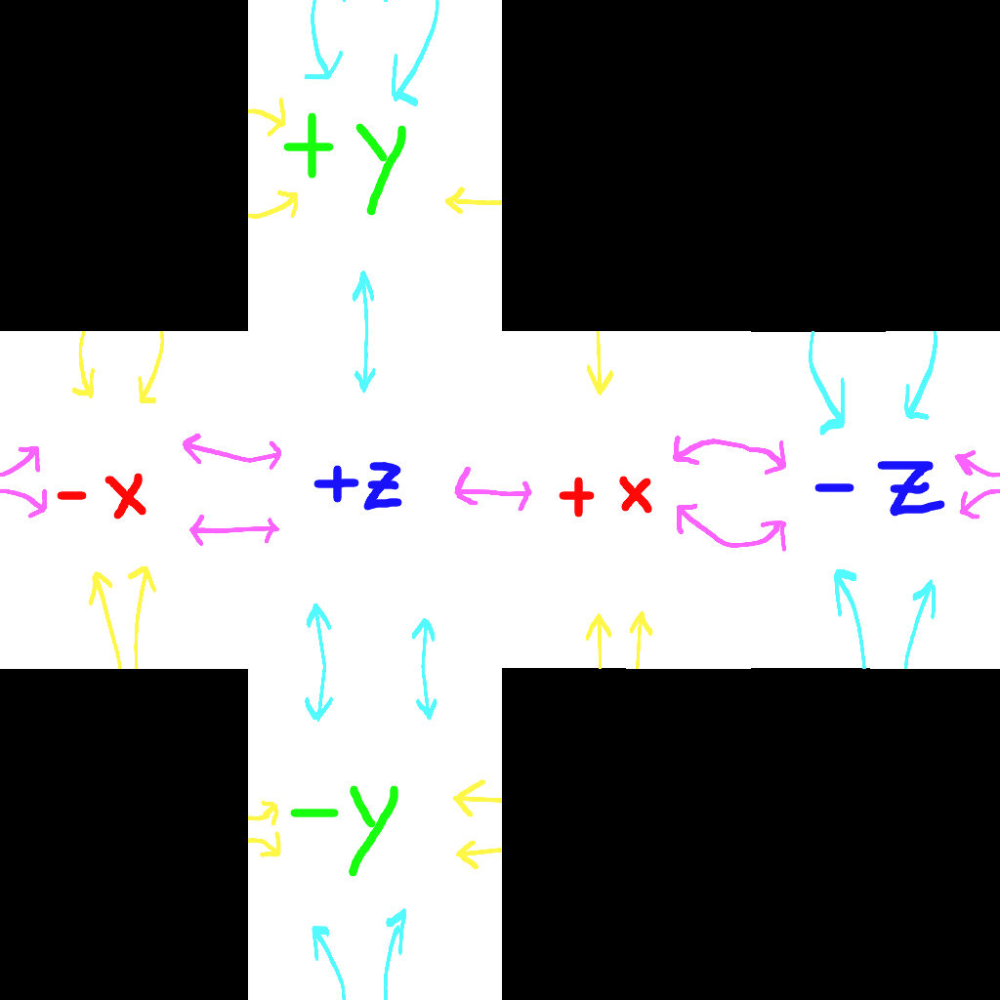
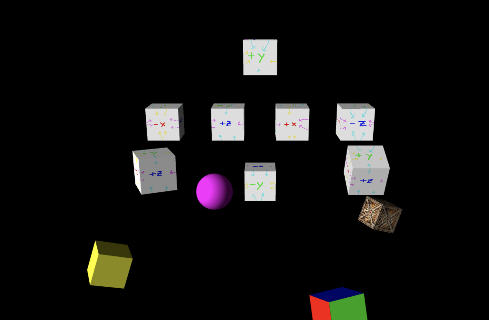

# Computer Graphics - Texturing

In this lab, you will apply the UV-mapping concepts discussed in class to apply image textures to 3D objects.

We will go through the provided code for the `UVMesh` class and the corresponding shader in class to demonstrate how images and texture coordinates are passed into the shader and used within it.

Your job for this lab is to complete three functions to generate texture coordinate arrays. The first will apply the entirety of an image to all six sides of a cube. The second will unwrap a cube onto a provided test texture, so each face contains the appropriate portion of the texture. The third will map a sphere to a spherical texture.

To complete this lab, you should follow these steps:

1. Without editing anything, run the lab. You should see a purple sphere, a yellow cube and a multi-colored cube all orbiting the origin.
2. Complete the `Cube.uvRepeatArray()` method in `shapes.js`, located in the `mesh` folder. You will need to reference `Cube.positionArray()` in order to put the vertices in the same order in the texture coordinates array as in the position array.
3. Search for `** STEP 1 **` in `demo.js`. Uncomment the lines to create and translate the `radioactiveCrate` object, as well as those in the `main` which rotate and draw it. Once the `radioactiveCrate` is cleanly textured, with the entirety of the provided texture displayed on each side, you're ready to move on.
4. Complete `Cube.uvUnwrappedArray()` to map a cube to the provided unwrapped cube texture: 
 
 Again, reference the position array to determine what order to put the texture coordinates in, such that the correct display is on each face and all of the arrows match. Note that the image is proportioned such that the relevant *u* coordinates (from left to right) are 0, 1/4, 1/2, 3/4 and 1 and the relevant *v* coordinates (from top to bottom) are 0, 1/3, 2/3 and 1.
5. Search for `** STEP 2 **` in `demo.js`; again, uncomment the appropriate parts to create and draw test cubes as instructed by the comments. You should see 8 copies of the textured cube. There should be four in a row, from left to right, showing the "-x", "+z", "+x" and "-z" faces, in that order, with the text upright. There should be one above this row displaying the "+y" face, upright, and one below displaying the "-y" face, upright. Finally, there should be two to the sides which are spinning, to let you verify that all of the arrows line up:
 
 Once you see the display above, you're done!
6. (**OPTIONAL**) Complete the `Sphere.uvArray()` method to generate texture coordinates to map a spherical model to a spherical texture. Use `Sphere.positionArray()`, both as an example and to match the vertex order in the texture coordinate array to that of the position array. When you're done, search for `** STEP 3 **` in `demo.js` and uncomment the appropriate lines to create and rotate a textured Earth model. If your texture coordinate array is correct, the Earth should be geographically correct, with the north pole at the top and the south pole at the bottom. Verify that the east and west directions are correct by finding a landmark (it should be pretty easy to pick out Africa).
7. (**OPTIONAL**) Complete the `TODO`s `UVBumpMesh` class in `uvbumpmesh.js` and the `TODO`s in the corresponding shaders (`vert.uvbump.glsl` and `frag.uvbump.glsl`). Then, search for `** STEP 4 **` and uncomment the corresponding pieces. You should see a cube in the top-left rotating, and its flat faces should be given some shading to match the bumps displayed on its texture.
