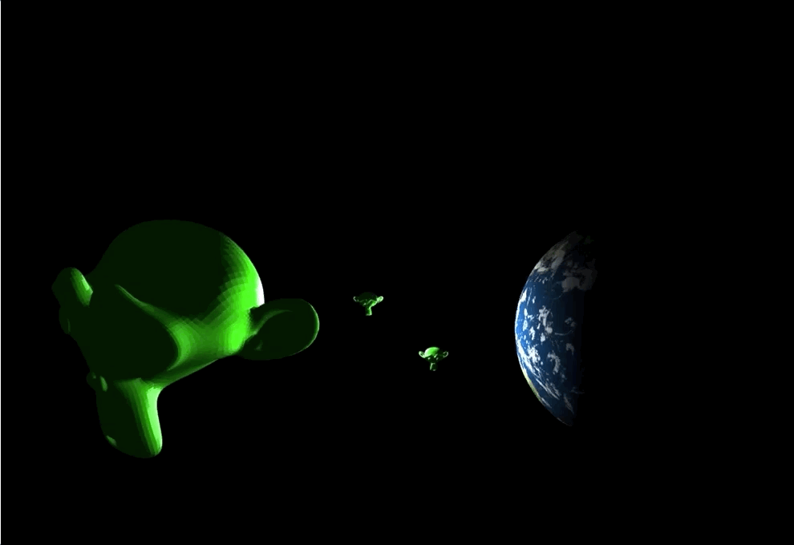
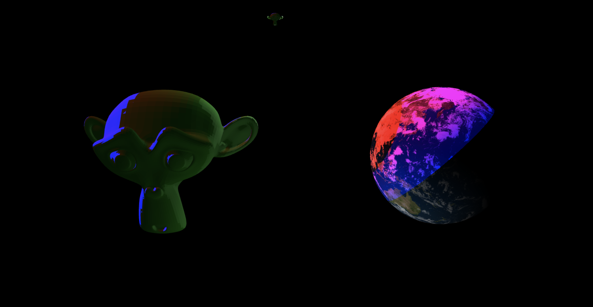

# Computer Graphics - Phong Lighting

In this lab, you will implement the Phong Lighting Model.

Your goal is to complete the two fragment shaders [frag.rgb.glsl](./lab/shaders/frag.rgb.glsl) and [frag.uv.glsl](./lab/shaders/frag.uv.glsl); you must use the uniform and varying data passed provided to calculate the displayed fragment color. You may find the [Phong lighting cheatsheet](./cheatsheet.pdf) helpful; it provides a summary of the lighting model that we will discuss in class.

When your shaders have been completed successfully, you should see two small lights circling two models:

The two lights that are circling are point lights; they do not test directional lights. You can test your directional light implementation by finding the "TODO" in [demo.js](./lab/demo.js) and uncommenting the corresponding lines to add in directional light. With the provided lighting parameters, the directional light has very bright blue specular light
and very bright red diffuse light, so the result should look something like this:

Feel free to check out the light management utilities provided in the [light](./lab/light) directory and their use in [demo.js](./lab/demo.js).
